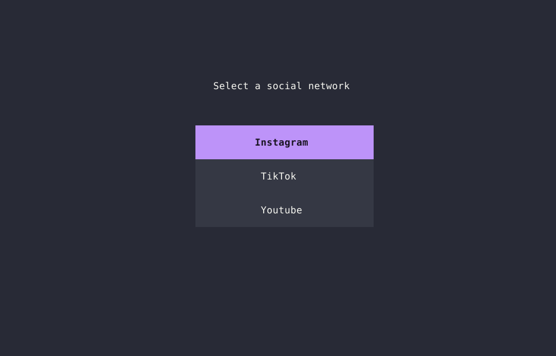
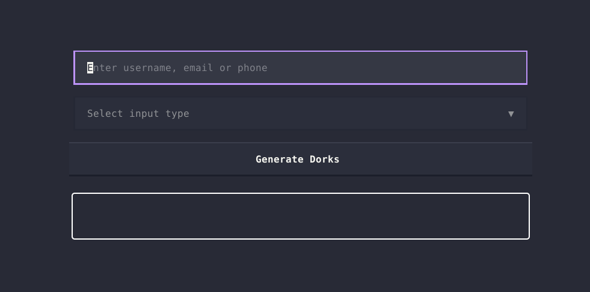

<a id="top"></a>

<p align="center">
    
</p>

 <h6><p align="center">
 All-in-one OSINT toolkit
</p></h6>
</p>

<br>

<p align="center">
  
  
  
</p>

<p align="center">
    
</p>

---
> [!WARNING]
> This tool is intended for ethical OSINT and educational use only. The author is not responsible for any misuse. Use at your own risk and comply with all applicable laws.

- [**Near**](#top)
    - [What it does](#what-it-does)
    - [Why](#why)?
- [Installation](#installation)
    - [Prerequisites](#rerequisites)
    - [Initial setup](#initial-setup)
    - [Running from source](#running-from-source)
- [Usage](#usage)
    - [Scan Username](#scan-username)
    - [Social Scraper](#social-scraper)
    - [Dorks Generator](#dorks-generator)
- [Todo](#todo) 

---

### What it does
Near is a comprehensive OSINT toolkit designed to consolidate essential open-source intelligence gathering capabilities into a single terminal user interface.

### Why
Near was born from the need to consolidate multiple OSINT tools into a single toolkit. It simplifies the workflow by removing the need to manage multiple tools, while also providing a personal space to experiment with and learn modern OSINT techniques.

### Installation

### Prerequisites
- Git  
- Python 3 (version 3.6 or higher recommended)  
- pip 

### Initial setup

```
pip3 install -r requirements.txt  
```

### Running from source

```
python3 near.py
```

### Usage

Once the program is launched, you will see an interface presenting a variety of tools. Let’s explore each of them in detail.

### Scan Username
The Scan Username tool performs a multi-threaded search to quickly check the existence of a username across multiple social platforms. A demonstration of this feature is shown [at the beginning](#top) of this README file.

### Social Scraper
The Social Scraper provides an interface to scrape basic information from various social media platforms.

<p align="center">
    
</p>

### Dorks Generator
The Dorks Generator creates Google dorks tailored for various needs, such as searching for passwords, emails, phone numbers, and more

<p align="center">
    
</p>


### Todo
- [ ] Add Facebook Scarping 
- [ ] Add Linkedin Scarping  
- [ ] Add Reddit Scarping  
- [ ] Add more general tool
