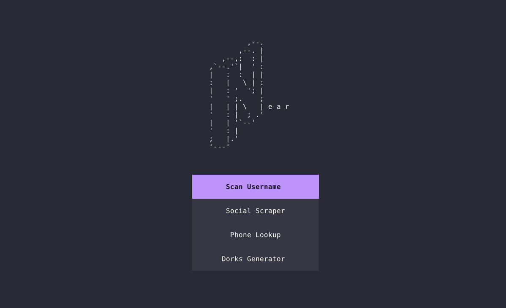
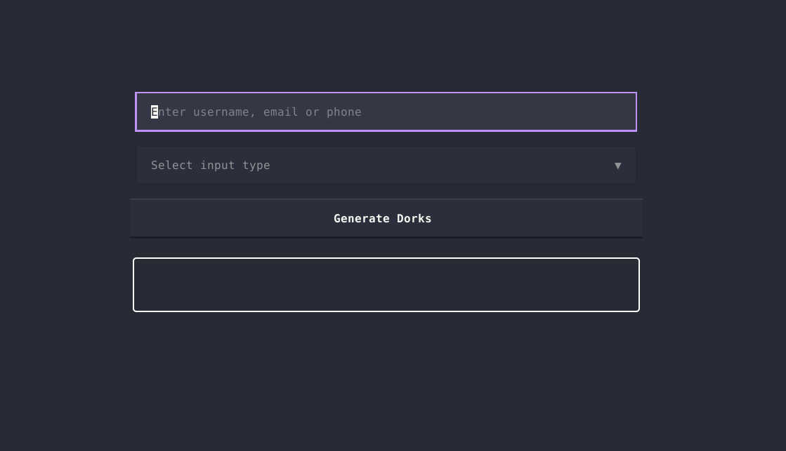

    

 <h6>

 All-in-one OSINT toolkit

</h6>

 

  
  
  

    

---
> [!WARNING]
> This tool is intended for ethical OSINT and educational use only. The author is not responsible for any misuse. Use at your own risk and comply with all applicable laws.

- [**Near**](#top)
    - [What it does](#what-it-does)
        - [See it in action](#see-it-in-action)
    - Why?
- Installation
    - Prerequisites
    - Initial setup
    - Running from source
- Usage
    - Scan Username
    - Social Scraper
    - Phone Lookup
    - Dorks Generator
- Future Projects
    - Todo

## What it does
Near is a comprehensive OSINT toolkit designed to consolidate essential open-source intelligence gathering capabilities into a single terminal user interface.

### Screenshots

  
  
  

## Todo
- [ ] Add Facebook Scarping 
- [ ] Add Linkedin Scarping  
- [ ] Add Reddit Scarping  
- [ ] Add more general tool
